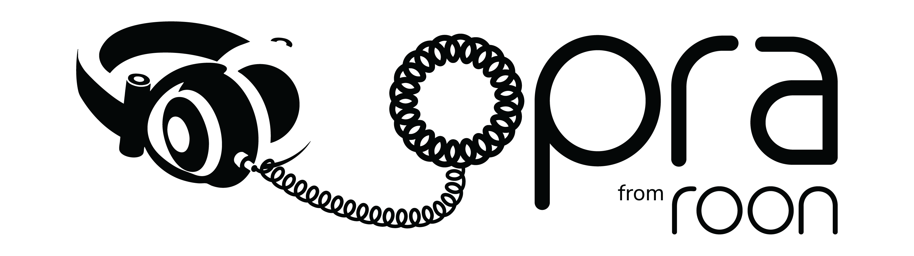
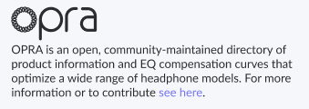
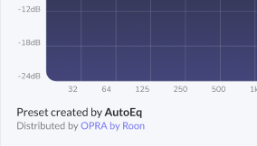

## About

OPRA is an open, community-maintained directory of product information and EQ compensation 
curves that optimize a wide range of headphone models. Our mission is to simplify and reduce the 
effort required to unlock the full potential of your headphones regardless of your level of experience, 
which software you choose to use, or the price point of your gear. 

Headphone EQ information is spread across the internet in forums, subreddits, and Discord
channels. It is all out there, but not very accessible. At the same time, there are pricey 
commercial headphone correction products, but they only work in certain software and with certain 
headphones. We believe that the community is doing a better job measuring headphones and developing EQ curves, 
but their work is fragmented, not easily accessed in player software, and difficult for people to use. 

We have seen how efforts like [Wikipedia](https://wikipedia.com), [MusicBrainz](https://musicbrainz.org), and
the [Open Source Seed Initiative](https://osseeds.org) successfully disrupt commercial
spaces with open products, and we see an opportunity to do the same. 

OPRA collects, organizes, and distributes this information in a way that makes it easy for 
the software you are already using to benefit from the work that headphone communities are 
already doing. This open dataset is intended to be a resource that anyone can use, whether for
personal projects, open-source applications, or commercial applications, with
minimal restrictions.

The OPRA project started at Roon Labs, the makers of [Roon](https://roon.app) and 
Roon Labs continues to contribute by maintaining the repository, producing vendor 
and product artwork, and assisting with data ingestion and cleanup.

## How do I contribute to the database?

Follow our file and directory structure, and submit a PR with your changes.

See [CONTRIBUTING.md](docs/CONTRIBUTING.md) for more detailed documentation.

## How do I consume this database?

The dataset is automatically generated after every commit to the repository. It is designed to be easily used by player
software. 

See [CONSUMING.md](docs/CONSUMING.md) for information about the dataset formats, and how to best consume the data. 

## FAQ

### How is this repository licensed?

The code in this repository is released under the [MIT license](https://opensource.org/license/mit).

Manufacturer, product, and EQ data is licensed under [CC BY-SA 4.0](https://creativecommons.org/licenses/by-sa/4.0/legalcode.en), in a similar
manner to Wikipedia. This license allows both commercial and non-commercial use and
ensures that derivative works remain available to the community.

Attribution is required at two levels. If you are presenting a browser for the 
OPRA database, please include the OPRA logo, as well as a brief description of what the 
project is all about and a link to the repository. You can find OPRA logos in PNG format in the `images/` folder.  

For example:

When attributing presets, it is important to credit the preset creator as well 
as providing a link to the OPRA GitHub page. If possible, please make the preset 
creator attribution more visually prominent than the OPRA attribution.

For example:

### Who is Roon Labs?

Roon Labs is the team that makes Roon. For more information about Roon, see https://roon.app.

### Why is Roon Labs doing this?

A lot of Roon users are also headphone enthusiasts, but getting headphone EQs
into playback software is a manual process that involves combing internet forums 
and manually entering data into playback software. This is intimidating for people
new to the hobby, and inefficient for the rest of us.

EQ curves are described in varying formats and terms, sometimes delivered via pdf,
or simply in forum messages. Terminology is inconsistent, and information appears
in varying levels of readiness for use. There is no one-size-fits-all solution 
for importing an EQ specification into a piece of software. 

At the same time, we did not see it as our place to move into a new space and start
claiming territory. We believe that something like OPRA should exist, and that it would be 
best for everyone if it is available to all, so while Roon will certainly integrate 
and contribute to OPRA, it's not our intent to control its destiny. 

### How is Roon Labs involved in this project?

Roon has set up the repository, defined the git-based database format, built the
documentation and tooling, and created a system that makes this data available
to software that might make use of it. We have also contributed significant amounts
of vendor and product artwork to ensure that products based on OPRA look great.

We will be approving PRs as the community builds out the repository, and as leaders emerge 
in the community, we will share this responsibility with others to ensure that this project 
is resilient in the long term. 

Going forward, we will work to keep the data set clean and consistent so that when it
is utilized within a product, the experience is great. We will use our graphic design team 
to maintain high quality product and manufacturer artwork, as we recognize that many people 
interested in contributing data may not be in a position to produce high quality graphics assets.

### Where is the data coming from?

This repository is intended to aggregate the output of major creators of EQ curves from
the headphones communities. We have kicked things off by ingesting and cleaning the data 
from [the AutoEQ project](https://github.com/jaakkopasanen/AutoEq), as it is already 
released under a permissive license. 

Early collaborations are under development with likeminded leaders such as 
[oratory1990](https://www.reddit.com/r/oratory1990/) and we look forward to sharing 
updates soon.

We hope that over time other major creators of EQ compensation curves will choose to be 
a part of this effort, and we look forward to collaborating with the community to see
where you want to take it next.

### Who can use this data?

It is our hope that this dataset will be used by everyone--hobbyists, open source
projects, and commercial products, and that it will become the canonical place where 
headphone models and EQ adjustments are cataloged and distributed.

### Will community members be able to approve PRs?

As strong contributors and leaders emerge in the community, we will distribute merge
permissions accordingly.
