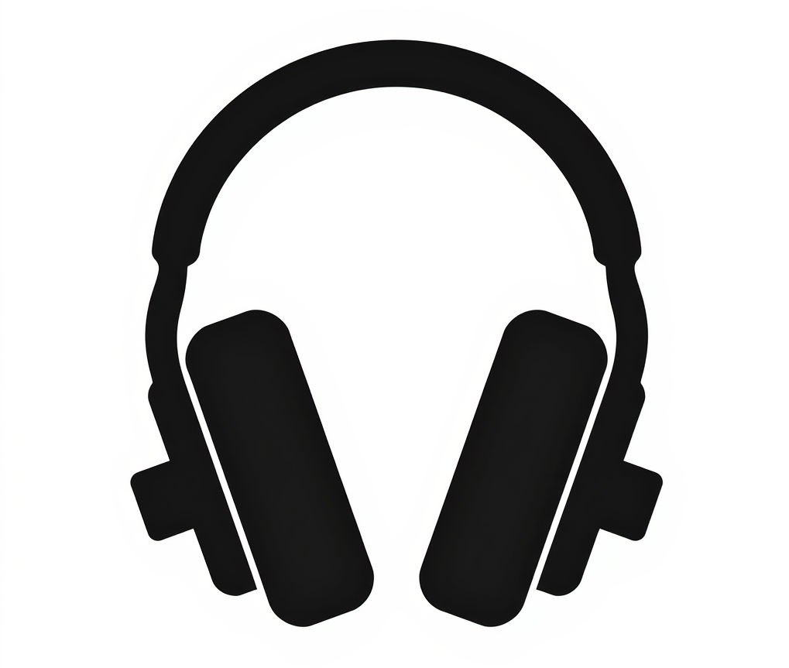

## About

OPRA is an open, community-maintained directory of product information and EQ compensation 
curves that optimize a wide range of headphone models. 

This open dataset is intended to be a resource that anyone can use, whether for
personal projects, open-source applications, or commercial applications, with
minimal restrictions.

The OPRA project started at Roon Labs, makers of the [Roon](https://roon.app) music 
management software, but our intent is to for this this to be community-driven project. 
Roon will assist on an ongoing basis with ingesting and cleaning data and generating
graphics assets for brands and headphones.

## How do I contribute to the database?

Follow our file and directory structure, and submit a PR with your changes.

See [CONTRIBUTING.md](docs/CONTRIBUTING.md) for more detailed documentation.

## How do I consume this database?

The dataset is published in the `dist/` folder, which is automatically updated after
every commit to the repository.

See [CONSUMING.md](docs/CONSUMING.md) for information about the dataset formats.

## FAQ

### How is this repository licensed?

The code in this repository is released under the [MIT license](https://opensource.org/license/mit).

Manufacturer, product, and EQ data is licensed under [CC BY-SA 4.0](https://creativecommons.org/licenses/by-sa/4.0/legalcode.en), in a similar
manner to Wikipedia. This license allows both commercial and non-commercial use and
ensures that derivative works remain available to the community.

If your project incorporates data from this repository, you must display a link
to this repository in a location that is visible to the user when interacting
with this data. Please give credit to the "OPRA from Roon" as well as the author 
of the headphone preset.

<<TODO: example screenshot from Roon showing proper attribution>>

### Why is Roon Labs doing this?

A lot of Roon users are also headphone enthusiasts, but getting headphone EQs
into playback software is often a manual process that involves combing internet
forums and confusing steps, especially for people new to the hobby.

EQ curves are described in varying formats and terms, sometimes delivered via pdf,
or simply in forum messages. Terminology is inconsistent, and information appears
in varying levels of readiness. There is no one-size-fits-all solution for importing
and EQ into a piece of software.

We want to make that easier for headphone enthusiasts regardless of what software
they choose to use. We also want to help new members of the community, who may
be as active on internet forums, to find these resources in their software of choice.

We felt that an open approach would be more beneficial for everyone involved, and that
we are in a good position to donate some of our resources to ensure that the dataset
is useful and of high quality.

### How is Roon Labs involved in this project?

Roon has set up the repository, defined the git-based database format and written the
documentation and tooling that surround this dataset. We will also be reviewing approving
PRs as the community builds out the repository, and as leaders emerge in the community,
we will share this responsibility.

Going forward, we will work to keep the data set clean and consistent so that when it
is utilized within a product, the experience is great. We also plan to use our graphic
design team to maintain high quality product and manufacturer artwork, as we recognize that
many people interested in contributing data may not be in a position to produce
suitable graphics assets.

### Who can use this data?

It is our hope that this dataset will be used by everyone--hobbyists, open source
projects, and commercial products (yes, even our competition), and that it will become
the canonical place where headphone models and EQ adjustments are cataloged and distributed.

### Will community members be able to approve PRs?

As strong contributors and leaders emerge in the community, we will distribute merge
permissions accordingly.
